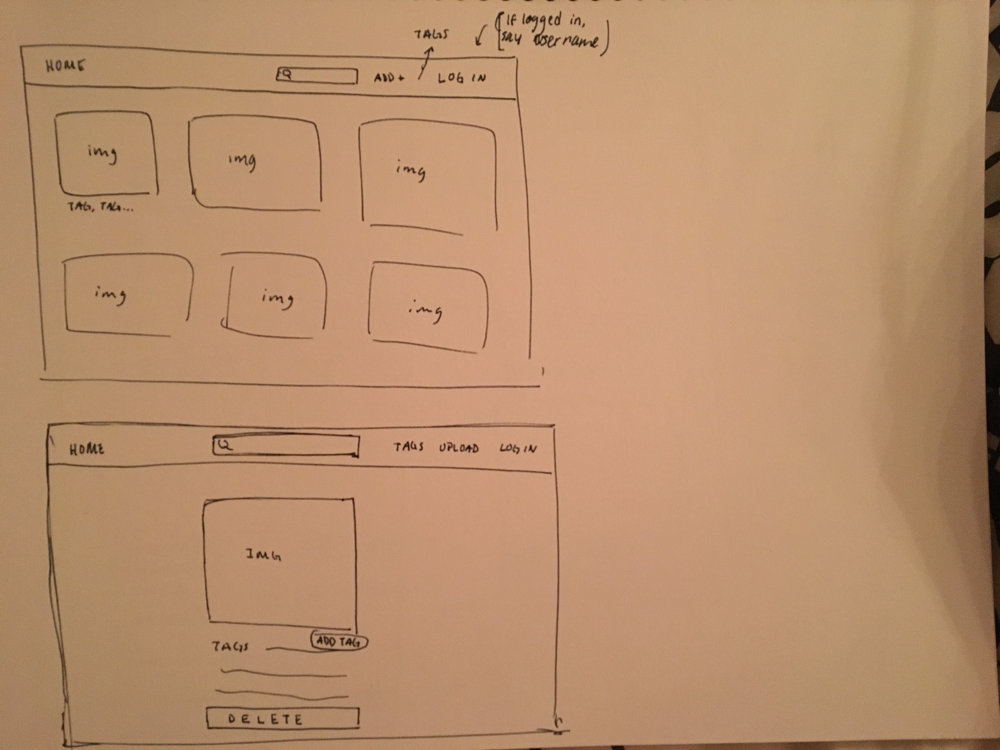

# Project 3 - Design & Plan

Your Name: Hanna Arfine

## 1. Persona

I've selected Abby as my persona.

I've selected my persona because I want to create an intuitive website that users such as
Abby would be able to use easily without becoming confused or frustrated.

## 2. Sketches & Wireframes

### Sketches



### Wirefames


This design is very simple and straightforward in its functionalities, which appeals to Abby's desire to spend little time exploring functionalities. There is little chance for error, as the site limits which functionalities the user has access to. For instance, Abby wouldn't even see the possibility of uploading a photo unless she was logged in,
reducing any confusion as to why she may not be able to upload.


## 3. Database Schema Plan

[Describe the structure of your database. You may use words or a picture. A bulleted list is probably the simplest way to do this.]

Table: accounts
* field 1: id INTEGER NOT NULL PRIMARY KEY AUTOINCREMENT UNIQUE
* field 2: username TEXT NOT NULL UNIQUE
* field 3: password TEXT NOT NULL
* field 4: session TEXT UNIQUE

Table: images
* id: INTEGER NOT NULL PRIMARY KEY AUTOINCREMENT UNIQUE
* image_name: TEXT NOT NULL
* tags: TEXT

Table: tags
* id: INTEGER NOT NULL PRIMARY KEY AUTOINCREMENT UNIQUE
* tag_name: TEXT NOT NULL
* images: TEXT (all image ID's that use this tag)

## 4. Database Query Plan

Home gallery:
* To view images: SELECT image_name FROM images
* To see tags (for each image): SELECT tag_name FROM tags WHERE images LIKE image_id  

View all tags:
* SELECT tag_name FROM tags

View single image:
(get image id from clicking on image)
* SELECT image_name, tags FROM images WHERE id='2'

Add an image:
* INSERT INTO images (image_name, tags) VALUES ('', '')
* INTO INTO tags (tag_name, images) VALUES ('', '')

## 5. Structure and Pseudocode

### Structure

[List the PHP files you will have. You will probably want to do this with a bulleted list.]

* index.php - main page.
* includes/init.php - stuff that's useful for every web page.
* includes/header.php
* tags.php - show all tags
* upload.php
* login.php
* photo.php - show full details for single entry

### Pseudocode

[For each PHP file, plan out your pseudocode. You probably want a subheading for each file.]

#### index.php

```
Pseudocode for index.php...

include init.php
include header.php

sql = SELECT * FROM images

for each image in images
  display image
  display tags


```

#### includes/init.php

```
messages = array to store messages for user (you may remove this)

// DB helper functions (you do not need to write this out since they are provided.)

db = connect to db

...

pages array

```

#### includes/header.php
```
for each page in pages
  header nav item with link to page
```

#### tags.php
```
sql = SELECT * FROM tags

for each record in records
  display tag_name
```

#### upload.php
```
form to upload image
INSERT INTO images (image_name, tags) VALUES ('', '')
INTO INTO tags (tag_name, images) VALUES ('', '')

```

## 6. Seed Data - Username & Passwords

[List the usernames and passwords for your users]

* user1 : hanna
* password1 : bailey97

* user2 : dave
* password2 : leo1999
